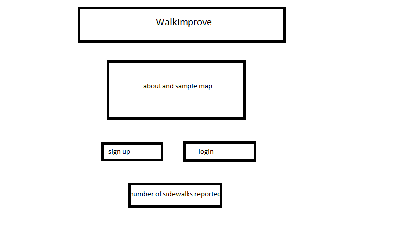
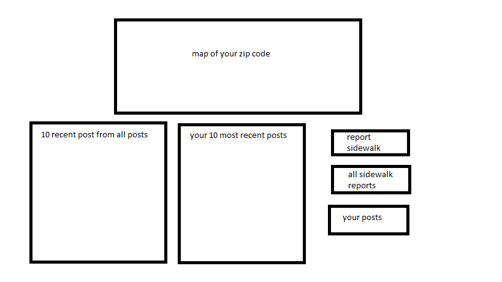
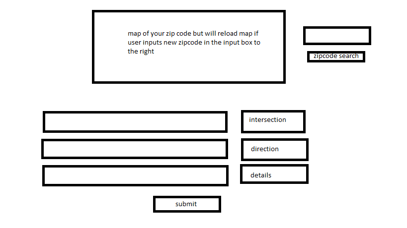
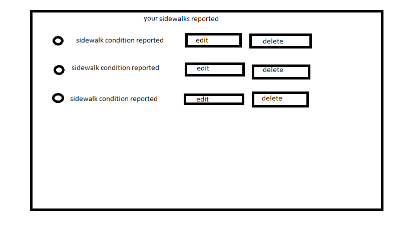
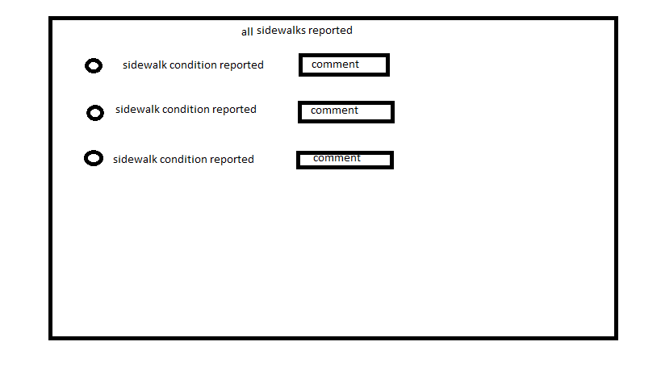
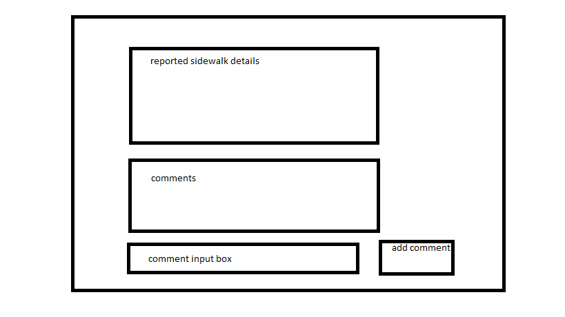
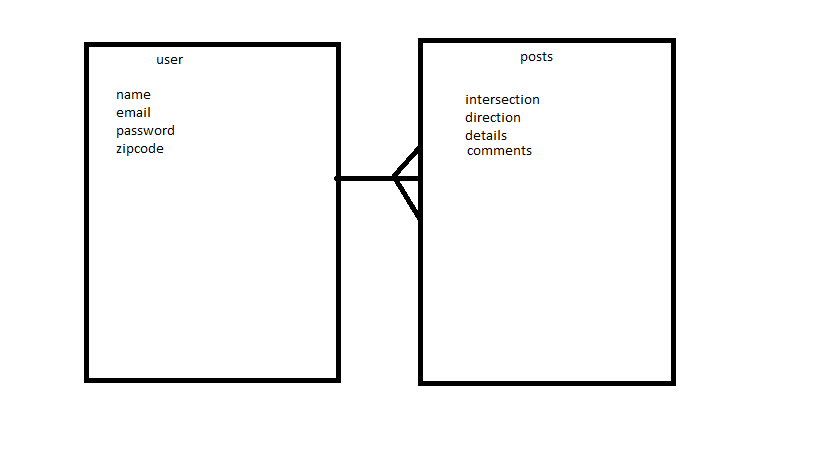
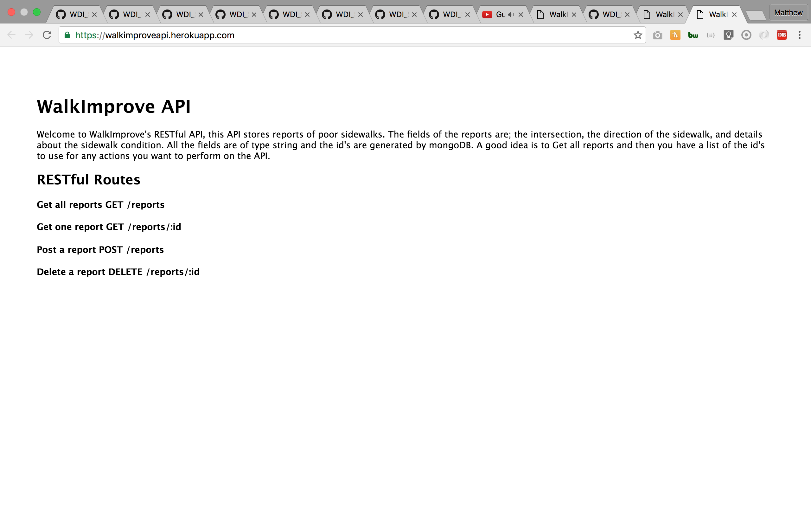
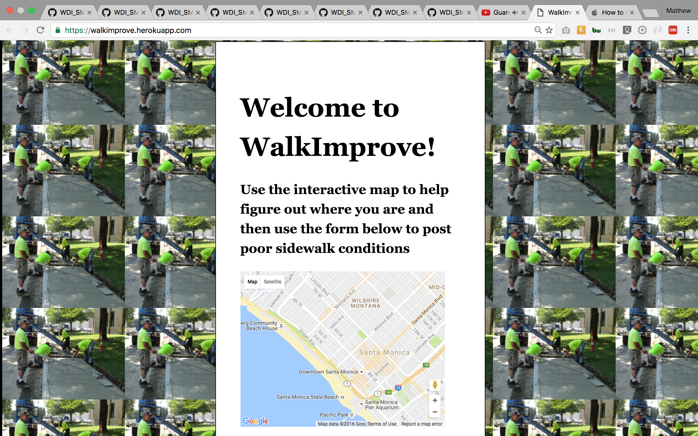

#WalkImprove - A sidewalk condition reporting app

* I want this project to be a message board style app so that residents of a neighborhood can report poor sidewalk conditions. Currently the city of Los Angeles is in a terrible situation where after a large lawsuit with the ADA they have the massive task of fixing their sidewalks. There is little data available about sidewalk conditions and the city is unsure how to best use their resources. The idea of WalkImprove is to get residents to provide data about poor sidewalk conditions to help illustrate where the city should spend there money, where people are walking and noticing things, and engage citizens to take a stake in their urban environment. The data and mapping from WalkImprove can be used for civic, non-profit or commercial purposes.

* Technologies used: MEAN stack, Mongo, Express, Angular, Node, HTML, CSS, Javascript, jQuery, Passport, Heroku, Google maps, Oauth2 and git.

#Wireframes

---------------------------------

---------------------------------

---------------------------------

---------------------------------

---------------------------------

---------------------------------

#ERD
  
---------------------------------

#WalkImprove API
[API repo](https://github.com/matthewbrozen/walkimproveapi)

#WalkImprove API Screen Shot

#WalkImprove Front End Repo
[front end repo](https://github.com/matthewbrozen/walkimprovefrontend)

#WalkImprove Front End Screen Shot

